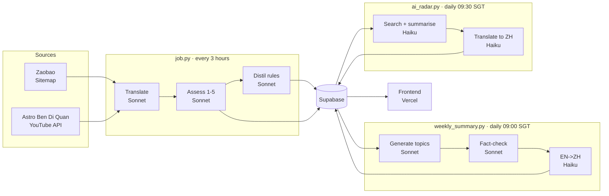

# NewsLingo

> Chinese & English bilingual news  
> **Live: [newslingo.chiawei.me](https://newslingo.chiawei.me/)**

Read Chinese news alongside English translations and follow current events while picking up natural English phrasing. Headlines from **Zaobao** and **Astro Ben Di Quan** are scraped every 3 hours, translated by Claude, and organised into International / Singapore / Malaysia tabs.

The translation pipeline self-improves: a quality-assessment step scores each batch, distils rules from mistakes, and feeds them back into the next translation run. A shared summary drawer combines **Top Stories** and **AI Radar**, both refreshed daily from the past 7 days.

<table>
  <tr>
    <td></td>
    <td></td>
    <td></td>
  </tr>
  <tr>
    <td align="center"><sub>News feed</sub></td>
    <td align="center"><sub>About</sub></td>
    <td align="center"><sub>Inside AI</sub></td>
  </tr>
</table>

---

## Features

| Feature | How to access |
|---|---|
| Bilingual headlines | Main feed - tap any card |
| Top Stories + AI Radar | Sparkle icon in header - shared drawer with `General / AI`, a second filter row, and EN / 中 toggle |
| Translation Quiz | Pencil icon - type an EN translation, scored by semantic similarity |
| Word definitions | Tap any English word in a headline |
| Read aloud | Speaker icon on each card |
| Search | Search icon in header - full-text across both titles |
| Share | Share icon on each card |
| Inside AI | `...` -> Inside AI - distilled translation rules from past failures |
| Dark mode / font size | `...` -> Preferences |

---

## Stack

| Layer | Technology |
|---|---|
| Frontend | React + TypeScript, Chakra UI, Vite - deployed on Vercel |
| Translation scoring | Transformers.js (`all-MiniLM-L6-v2`) - in-browser semantic similarity for quiz |
| Backend | Python + `uv` |
| AI | Claude Sonnet 4.6 (translate, assess, distil, weekly summary) · Claude Haiku 4.5 (Top Stories EN->ZH, AI Radar generation + translation) |
| Database | Supabase (Postgres) |
| Observability | Langfuse Cloud - token counts, cost, latency, translation quality scores |
| Jobs | GitHub Actions - aggregation every 3h, Top Stories daily at 09:00 SGT, AI Radar daily at 09:30 SGT |

---

## How it works



**Aggregation (`job.py`):** scrapes Zaobao sitemaps and the Astro YouTube uploads playlist, translates headlines with Claude Sonnet, scores each translation 1-5, then distils failures into rules that improve the next run.

**Top Stories (`weekly_summary.py`):** three-pass pipeline. Pass 1 generates topic clusters, Pass 2 fact-checks claims against source headlines and corrects tense, and Pass 3 (Haiku) translates titles and summaries into Simplified Chinese.

**AI Radar (`ai_radar.py`):** daily AI-specific search-and-summarise job across governance, product, and infrastructure. It uses Anthropic web search, generates English summaries, then adds Simplified Chinese fields for the shared drawer.

---

## APIs & Services

| API | Purpose |
|---|---|
| [Anthropic Claude](https://anthropic.com) | Translation, assessment, distillation, Top Stories summary, AI Radar |
| [YouTube Data API v3](https://developers.google.com/youtube/v3) | Fetch Astro Ben Di Quan uploads |
| [Supabase](https://supabase.com) | Database + REST API |
| [Langfuse](https://langfuse.com) | LLM observability - cost, latency, translation quality scores |
| [ipapi.co](https://ipapi.co) | Visitor geolocation for analytics |
| [Free Dictionary API](https://dictionaryapi.dev) | Word definitions on tap |
| [Web Speech API](https://developer.mozilla.org/en-US/docs/Web/API/Web_Speech_API) | Read-aloud (browser built-in) |
| [Hugging Face Transformers.js](https://huggingface.co/docs/transformers.js) | In-browser quiz scoring (lazy-loaded) |

---

## Development

**Prerequisites:** Python 3.12+, Node 18+, `uv` ([install](https://docs.astral.sh/uv/))

Copy `.env.example` -> `.env` and `frontend/.env.example` -> `frontend/.env` and fill in your Supabase, Anthropic, YouTube, and Langfuse keys.

```bash
# Backend
uv sync
uv run job.py                # run one aggregation cycle
uv run weekly_summary.py     # run Top Stories summary
uv run ai_radar.py           # run AI Radar summary
uv run pytest -v             # run tests

# Frontend
cd frontend
npm install
npm run dev
```

Tests cover: URL->category mapping, scraper output schema, Claude JSON parsing, architectural invariants, Top Stories three-pass pipeline, AI Radar parsing/rotation/translation behavior, and translation assessment logic.
