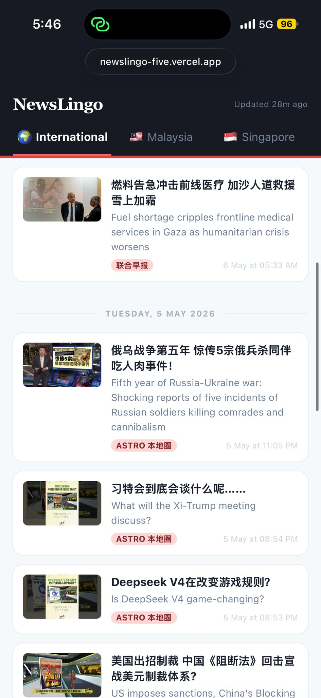

# NewsLingo

> 中英双语时事 · Chinese & English bilingual news

A personal tool for reading Chinese news alongside English translations — so you can follow current events you already understand while naturally picking up the proper English vocabulary and phrasing used in journalism.

News is pulled from two sources every 3 hours: **联合早报 (Zaobao)**, Singapore's main Chinese newspaper, and **Astro 本地圈**, a Malaysian YouTube news channel. Headlines are translated by AI, organised into International / Singapore / Malaysia tabs, and grouped by date.

The translation pipeline improves itself over time — after each run, a second AI reviews the translations, scores them, and rewrites the prompt rules to fix recurring mistakes. The **Inside AI** section in the ··· menu shows a daily digest of what the AI gets right, wrong, and is improving — presented as concise bullet observations per region.

**This Week** (··· menu) runs every Monday and presents the past week's news as 5–8 topic clusters — important stories grouped by theme with 2–3 sentence summaries, across all three regions.

Reader features: tap any English word for an inline definition, tap the speaker icon to hear the headline read aloud, tap the share icon to share the headline (both titles + URL) via the native share sheet. Font size and dark mode are configurable via the ··· menu.



---

## Stack

| Layer | Technology |
|---|---|
| Frontend | React + TypeScript, Chakra UI, Vite — deployed on Vercel |
| Backend | Python, Claude Haiku (translate), Claude Sonnet (assess + improve) |
| Database | Supabase (Postgres) |
| Jobs | GitHub Actions — aggregation every 3h, digest daily, weekly summary Monday |

---

## APIs & Services

| API | Purpose | Cost |
|---|---|---|
| [Anthropic Claude](https://anthropic.com) | Translation (Haiku), assessment + distillation + digest (Sonnet) | Pay per token |
| [YouTube Data API v3](https://developers.google.com/youtube/v3) | Fetch Astro 本地圈 videos | Free quota |
| [Supabase](https://supabase.com) | Database, REST API | Free tier |
| [ipapi.co](https://ipapi.co) | Visitor geolocation for traffic analytics | Free tier |
| [Web Speech API](https://developer.mozilla.org/en-US/docs/Web/API/Web_Speech_API) | Headline pronunciation (read-aloud) | Browser built-in |
| [Free Dictionary API](https://dictionaryapi.dev) | Vocab tap — word definitions and phonetics | Free, no key |

---

## Running locally

**Prerequisites:** Python 3.12+, Node 18+, `uv` ([install](https://docs.astral.sh/uv/))

```bash
# Backend deps
uv sync

# Frontend deps
cd frontend && npm install
```

Copy `.env.example` to `.env` and fill in:
```
SUPABASE_URL=
SUPABASE_SERVICE_KEY=
ANTHROPIC_API_KEY=
YOUTUBE_API_KEY=
```

Copy `frontend/.env.example` to `frontend/.env` and fill in:
```
VITE_SUPABASE_URL=
VITE_SUPABASE_ANON_KEY=
```

```bash
# Run the aggregation job once
uv run job.py

# Run the daily digest
uv run digest.py

# Start the frontend dev server
cd frontend && npm run dev
```

---

## Tests

```bash
uv run pytest -v
```

Tests cover URL→category mapping, scraper output schema, Claude JSON parsing, and architectural invariants. The aggregation job is gated on tests passing — broken code never reaches production.
