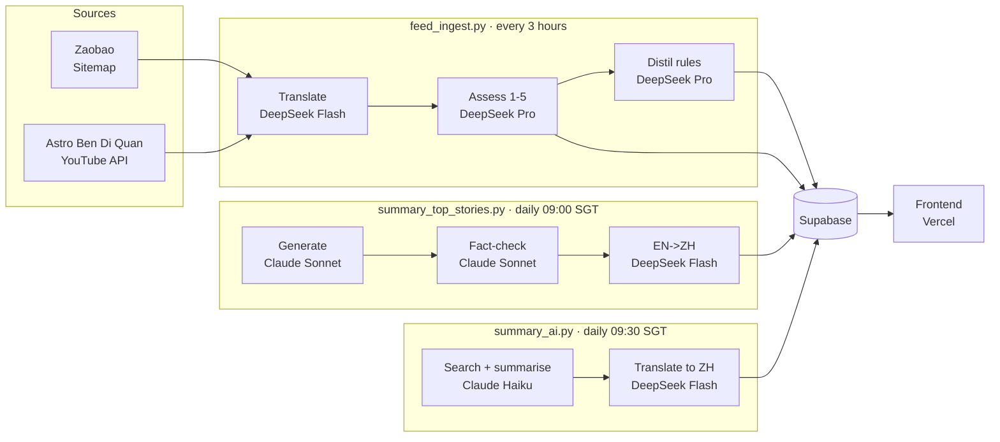

# NewsLingo

> Chinese & English bilingual news  
> **Live: [newslingo.chiawei.me](https://newslingo.chiawei.me/)**

Read Chinese news alongside English translations and follow current events while picking up natural English phrasing. Headlines from **Zaobao** and **Astro Ben Di Quan** are scraped every 3 hours, translated by DeepSeek, and organised into International / Singapore / Malaysia tabs.

The translation pipeline self-improves: a quality-assessment step scores each batch, distils rules from mistakes, and feeds them back into the next translation run. A shared summary drawer combines **Top Stories** and **AI Radar**, both refreshed daily from the past 7 days.

<table>
  <tr>
    <td></td>
    <td></td>
    <td></td>
  </tr>
  <tr>
    <td align="center"><sub>News feed</sub></td>
    <td align="center"><sub>About</sub></td>
    <td align="center"><sub>Inside AI</sub></td>
  </tr>
</table>

---

## Features

| Feature | How to access |
|---|---|
| Bilingual headlines | Main feed - tap any card |
| Top Stories + AI Radar | Sparkle icon in header - shared drawer with `General / AI`, a second filter row, and EN / 中 toggle |
| Translation Quiz | Pencil icon - type an EN translation, scored by semantic similarity |
| Word definitions | Tap any English word in a headline |
| Read aloud | Speaker icon on each card |
| Search | Search icon in header - full-text across both titles |
| Share | Share icon on each card |
| Inside AI | `...` -> Inside AI - distilled translation rules from past failures |
| Dark mode / font size | `...` -> Preferences |

---

## Stack

| Layer | Technology |
|---|---|
| Frontend | React + TypeScript, Chakra UI, Vite - deployed on Vercel |
| Translation scoring | Transformers.js (`all-MiniLM-L6-v2`) - in-browser semantic similarity for quiz |
| Backend | Python + `uv` |
| AI | DeepSeek V4 Flash (headline + summary translation) · DeepSeek V4 Pro (assessment + rule distillation) · Claude Sonnet 4.6 (Top Stories generation + fact-check) · Claude Haiku 4.5 (AI Radar search + summarisation) |
| Database | Supabase (Postgres) |
| Observability | Langfuse Cloud - token counts, cost, latency, translation quality scores |
| Jobs | GitHub Actions - Feed every 3h, Top Stories daily at 09:00 SGT, AI summary daily at 09:30 SGT, digest email manual-first |

---

## How it works



**Aggregation (`feed_ingest.py`):** scrapes Zaobao sitemaps and the Astro YouTube uploads playlist, translates headlines with DeepSeek Flash, scores each translation 1-5 with DeepSeek Pro, then distils failures into rules that improve the next run.

**Top Stories (`summary_top_stories.py`):** loads the last 7 days of feed headlines from Supabase, uses Claude Sonnet 4.6 to generate `8-10` must-know topics, runs a second Claude Sonnet 4.6 fact-check pass against the same headline block, and then uses DeepSeek Flash for Simplified Chinese translation.

**AI Radar (`summary_ai.py`):** daily AI-specific search-and-summarise job across governance, product, and infrastructure. Claude Haiku 4.5 performs web-grounded discovery and summarisation, Claude Sonnet 4.6 is the fallback when Haiku is unavailable, and DeepSeek Flash adds Simplified Chinese fields for the shared drawer.

---

## APIs & Services

| API | Purpose |
|---|---|
| [Anthropic API](https://www.anthropic.com/api) | Top Stories generation + fact-check, AI Radar web search + summarisation |
| [DeepSeek API](https://platform.deepseek.com/) | Headline translation, assessment, distillation, and Chinese translation passes |
| [Google Gemini API](https://ai.google.dev/) | Kept configured for future experiments; not required by the current summary runtime path |
| [YouTube Data API v3](https://developers.google.com/youtube/v3) | Fetch Astro Ben Di Quan uploads |
| [Supabase](https://supabase.com) | Database + REST API |
| [Langfuse](https://langfuse.com) | LLM observability - cost, latency, translation quality scores |
| [ipapi.co](https://ipapi.co) | Visitor geolocation for analytics |
| [Free Dictionary API](https://dictionaryapi.dev) | Word definitions on tap |
| [Web Speech API](https://developer.mozilla.org/en-US/docs/Web/API/Web_Speech_API) | Read-aloud (browser built-in) |
| [Hugging Face Transformers.js](https://huggingface.co/docs/transformers.js) | In-browser quiz scoring (lazy-loaded) |

---

## Development

**Prerequisites:** Python 3.12+, Node 18+, `uv` ([install](https://docs.astral.sh/uv/))

Copy `.env.example` -> `.env` and `frontend/.env.example` -> `frontend/.env` and fill in your Supabase, Anthropic, DeepSeek, Gemini, YouTube, Langfuse, and digest email settings.

```bash
# Backend
uv sync
uv run feed_ingest.py
uv run summary_top_stories.py
uv run summary_ai.py
uv run send_daily_digest.py --dry-run --language en
uv run python -m pytest -q

# Frontend
cd frontend
npm install
npm run dev
```

Tests cover: URL->category mapping, scraper output schema, JSON parsing, architectural invariants, Top Stories three-pass summary flow, AI Radar parsing/rotation/translation behavior, and translation assessment logic.

## Workflow map

| Workflow name | YAML file | Scope |
|---|---|---|
| `Feed - Ingest` | `.github/workflows/feed_ingest.yml` | Raw news feed pipeline: scrape, translate, classify, assess, distill, and write `headlines` |
| `Summary - Top Stories` | `.github/workflows/summary_top_stories.yml` | Runs the General Top Stories payload for the shared sparkle drawer |
| `Summary - AI` | `.github/workflows/summary_ai.yml` | Runs the AI summary payload for the shared sparkle drawer |
| `Digest - Email` | `.github/workflows/digest_email.yml` | Manual-first digest email renderer / sender with preview artifacts |
| `CI - Test` | `.github/workflows/ci_test.yml` | Ruff, pytest, and frontend build checks |
| `Ops - Keep Alive` | `.github/workflows/ops_keep_alive.yml` | Scheduled maintenance ping to keep Actions active |
